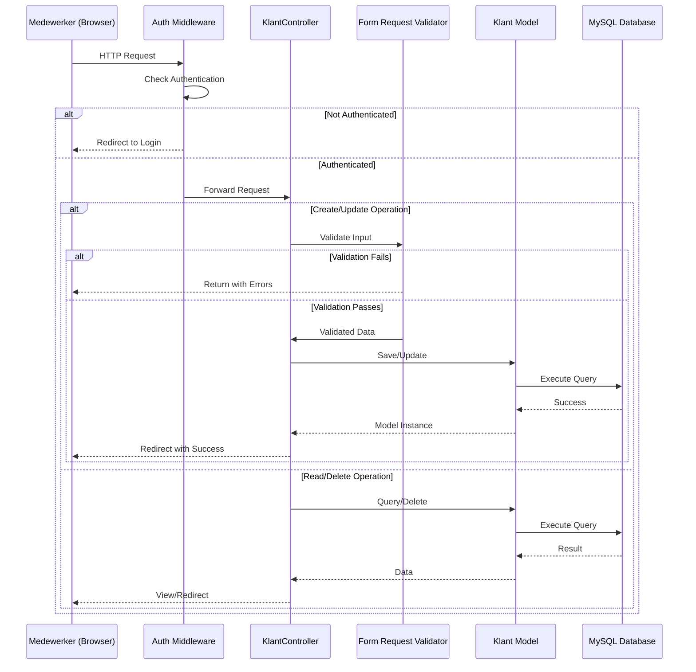

# Design Document: Klantenbeheer Systeem

## Overview

Het klantenbeheer systeem is een Laravel 13 CRUD applicatie voor het beheren van klantgegevens in een kapsalon/behandeling bedrijf. Het systeem biedt geauthenticeerde medewerkers de mogelijkheid om klanten aan te maken, te bekijken, bij te werken en te verwijderen.

### Key Design Goals

1. **Eenvoudige CRUD operaties**: Standaard Laravel resource controller patronen voor consistente implementatie
2. **Data-integriteit**: Robuuste validatie op zowel client-side als server-side
3. **Beveiliging**: Breeze authenticatie middleware beschermt alle klant-gerelateerde routes
4. **Gebruiksvriendelijkheid**: Duidelijke feedback en foutmeldingen voor gebruikers
5. **Laravel conventions**: Volgen van Laravel best practices voor maintainability

### Technology Stack

- **Framework**: Laravel 13
- **Authentication**: Laravel Breeze
- **Database**: MySQL (Examen-Dag1)
- **Frontend**: Blade templates met Tailwind CSS (via Breeze)
- **Validation**: Laravel Form Request validation

## Architecture

### Application Layer Structure

```
app/
├── Http/
│   ├── Controllers/
│   │   └── KlantController.php          # Resource controller voor CRUD operaties
│   └── Requests/
│       ├── StoreKlantRequest.php        # Validatie voor nieuwe klanten
│       └── UpdateKlantRequest.php       # Validatie voor klant updates
├── Models/
│   └── Klant.php                        # Eloquent model voor klant tabel
└── View/
    └── Components/
        └── (Breeze components)

resources/
└── views/
    └── klanten/
        ├── index.blade.php              # Klantenoverzicht
        ├── create.blade.php             # Nieuwe klant formulier
        ├── show.blade.php               # Klant details
        └── edit.blade.php               # Klant bewerken formulier

database/
├── migrations/
│   └── xxxx_create_klanten_table.php    # Database schema
└── factories/
    └── KlantFactory.php                 # Test data generator
```


### Request Flow



### Routing Strategy

All routes will be protected by the `auth` middleware from Breeze. The application follows RESTful resource routing conventions:

- `GET /klanten` - index (klantenoverzicht)
- `GET /klanten/create` - create form
- `POST /klanten` - store new klant
- `GET /klanten/{klant}` - show klant details
- `GET /klanten/{klant}/edit` - edit form
- `PUT/PATCH /klanten/{klant}` - update klant
- `DELETE /klanten/{klant}` - delete klant


## Components and Interfaces

### KlantController

**Responsibility**: Handle HTTP requests for klant CRUD operations

**Key Methods**:

```php
class KlantController extends Controller
{
    public function index(): View
    // Returns klanten index view with all klanten from database
    // Requirements: 3.1, 3.2, 4.1, 4.2, 4.3
    
    public function create(): View
    // Returns create form view
    // Requirements: 1.4
    
    public function store(StoreKlantRequest $request): RedirectResponse
    // Validates and creates new klant
    // Redirects to index with success message
    // Requirements: 1.1, 1.2, 1.3, 1.5, 2.1-2.6
    
    public function show(Klant $klant): View
    // Returns view with all klant details
    // Requirements: 3.3
    
    public function edit(Klant $klant): View
    // Returns edit form pre-filled with klant data
    // Requirements: 5.1
    
    public function update(UpdateKlantRequest $request, Klant $klant): RedirectResponse
    // Validates and updates existing klant
    // Redirects to show or index with success message
    // Requirements: 5.2, 5.3, 5.4, 5.5, 6.1-6.6
    
    public function destroy(Klant $klant): RedirectResponse
    // Deletes klant after confirmation
    // Redirects to index with success message
    // Requirements: 7.2, 7.3, 8.1, 8.2, 8.3
}
```

**Dependencies**:
- `StoreKlantRequest`: Validates new klant data
- `UpdateKlantRequest`: Validates klant updates
- `Klant`: Eloquent model for database operations


### StoreKlantRequest

**Responsibility**: Validate input when creating a new klant

**Validation Rules**:

```php
class StoreKlantRequest extends FormRequest
{
    public function rules(): array
    {
        return [
            'voornaam' => ['required', 'string', 'max:255'],
            'achternaam' => ['required', 'string', 'max:255'],
            'telefoonnummer' => ['required', 'string', 'regex:/^[0-9\s\-\+\(\)]+$/', 'max:20'],
            'email' => ['required', 'string', 'email', 'max:255'],
            'geboortedatum' => ['nullable', 'date', 'before:today'],
            'adres' => ['nullable', 'string', 'max:255'],
            'postcode' => ['nullable', 'string', 'regex:/^[1-9][0-9]{3}\s?[A-Z]{2}$/i'],
            'woonplaats' => ['nullable', 'string', 'max:255'],
            'allergieen' => ['nullable', 'string', 'max:1000'],
            'wensen' => ['nullable', 'string', 'max:1000'],
        ];
    }
    
    public function messages(): array
    {
        return [
            'required' => 'Vul alle verplichte velden in',
            'email.email' => 'Het email adres is ongeldig',
            'telefoonnummer.regex' => 'Het telefoonnummer is ongeldig',
            'postcode.regex' => 'De postcode is ongeldig',
            'geboortedatum.before' => 'De geboortedatum moet in het verleden liggen',
        ];
    }
}
```

**Requirements Coverage**: 2.1-2.6


### UpdateKlantRequest

**Responsibility**: Validate input when updating an existing klant

**Validation Rules**: Identical to `StoreKlantRequest` to ensure data integrity

```php
class UpdateKlantRequest extends FormRequest
{
    public function rules(): array
    {
        // Same rules as StoreKlantRequest
        return [
            'voornaam' => ['required', 'string', 'max:255'],
            'achternaam' => ['required', 'string', 'max:255'],
            'telefoonnummer' => ['required', 'string', 'regex:/^[0-9\s\-\+\(\)]+$/', 'max:20'],
            'email' => ['required', 'string', 'email', 'max:255'],
            'geboortedatum' => ['nullable', 'date', 'before:today'],
            'adres' => ['nullable', 'string', 'max:255'],
            'postcode' => ['nullable', 'string', 'regex:/^[1-9][0-9]{3}\s?[A-Z]{2}$/i'],
            'woonplaats' => ['nullable', 'string', 'max:255'],
            'allergieen' => ['nullable', 'string', 'max:1000'],
            'wensen' => ['nullable', 'string', 'max:1000'],
        ];
    }
    
    public function messages(): array
    {
        return [
            'required' => 'Alle verplichte velden moeten ingevuld zijn',
            'email.email' => 'De ingevoerde gegevens zijn ongeldig',
            'telefoonnummer.regex' => 'De ingevoerde gegevens zijn ongeldig',
            'postcode.regex' => 'De postcode is ongeldig',
            'geboortedatum.before' => 'De geboortedatum moet in het verleden liggen',
        ];
    }
}
```

**Requirements Coverage**: 6.1-6.6


### Klant Model

**Responsibility**: Eloquent model representing klant table and business logic

```php
class Klant extends Model
{
    use HasFactory;
    
    protected $table = 'klanten';
    
    protected $fillable = [
        'voornaam',
        'achternaam',
        'telefoonnummer',
        'email',
        'geboortedatum',
        'adres',
        'postcode',
        'woonplaats',
        'allergieen',
        'wensen',
    ];
    
    protected $casts = [
        'geboortedatum' => 'date',
        'created_at' => 'datetime',
        'updated_at' => 'datetime',
    ];
    
    // Accessor for full name (used in views)
    public function getVolledigeNaamAttribute(): string
    {
        return "{$this->voornaam} {$this->achternaam}";
    }
}
```

**Key Characteristics**:
- Uses Laravel's timestamp management (`created_at`, `updated_at`)
- Mass assignment protection via `$fillable`
- Date casting for proper date handling
- Computed attribute for display purposes

**Requirements Coverage**: 10.1-10.6


### View Components

#### index.blade.php (Klantenoverzicht)

**Purpose**: Display list of all klanten with options to view, edit, delete

**Key Elements**:
- Table displaying voornaam, achternaam, email for each klant
- "Nieuwe klant" button linking to create form
- Action buttons (view, edit, delete) for each klant
- Empty state message when no klanten exist
- Delete confirmation using JavaScript confirmation dialog

**Requirements Coverage**: 3.1, 3.2, 3.4, 4.1, 4.2, 4.3

#### create.blade.php (Nieuwe Klant Formulier)

**Purpose**: Form for creating a new klant

**Key Elements**:
- Form with all klant fields (voornaam, achternaam, telefoonnummer, email, geboortedatum, adres, postcode, woonplaats, allergieen, wensen)
- Required field indicators for verplichte velden
- Validation error display
- Save and Cancel buttons
- Uses Breeze form components for consistent styling

**Requirements Coverage**: 1.4

#### edit.blade.php (Klant Bewerken Formulier)

**Purpose**: Form for updating existing klant

**Key Elements**:
- Pre-filled form with current klant data
- Identical structure to create form
- All fields editable
- Validation error display
- Save and Cancel buttons

**Requirements Coverage**: 5.1, 5.5

#### show.blade.php (Klant Details)

**Purpose**: Display all details of a single klant

**Key Elements**:
- Read-only display of all klantgegevens
- Edit and Delete buttons
- Back to list button
- Formatted display of dates and optional fields

**Requirements Coverage**: 3.3


## Data Models

### Klanten Table Schema

```sql
CREATE TABLE klanten (
    id BIGINT UNSIGNED AUTO_INCREMENT PRIMARY KEY,
    voornaam VARCHAR(255) NOT NULL,
    achternaam VARCHAR(255) NOT NULL,
    telefoonnummer VARCHAR(20) NOT NULL,
    email VARCHAR(255) NOT NULL,
    geboortedatum DATE NULL,
    adres VARCHAR(255) NULL,
    postcode VARCHAR(10) NULL,
    woonplaats VARCHAR(255) NULL,
    allergieen TEXT NULL,
    wensen TEXT NULL,
    created_at TIMESTAMP NULL DEFAULT NULL,
    updated_at TIMESTAMP NULL DEFAULT NULL
);
```

### Field Specifications

| Field | Type | Required | Validation | Description |
|-------|------|----------|------------|-------------|
| id | BIGINT UNSIGNED | Yes (Auto) | Primary Key | Unique identifier |
| voornaam | VARCHAR(255) | Yes | max:255 | Customer first name |
| achternaam | VARCHAR(255) | Yes | max:255 | Customer last name |
| telefoonnummer | VARCHAR(20) | Yes | regex pattern | Phone number with flexible format |
| email | VARCHAR(255) | Yes | email format | Customer email address |
| geboortedatum | DATE | No | date, before:today | Customer birth date |
| adres | VARCHAR(255) | No | max:255 | Street address |
| postcode | VARCHAR(10) | No | Dutch postcode regex | Postal code (1234AB format) |
| woonplaats | VARCHAR(255) | No | max:255 | City |
| allergieen | TEXT | No | max:1000 | Customer allergies |
| wensen | TEXT | No | max:1000 | Customer wishes/preferences |
| created_at | TIMESTAMP | Auto | - | Record creation timestamp |
| updated_at | TIMESTAMP | Auto | - | Last update timestamp |

**Design Decisions**:

1. **No unique constraint on email**: Business requirement not specified; allows flexibility for shared family emails
2. **Flexible phone number format**: Regex allows international formats, spaces, parentheses, dashes
3. **TEXT fields for allergieen/wensen**: Allows detailed notes beyond 255 character limit
4. **Dutch postcode validation**: Specific format (1234AB) for Netherlands postal codes
5. **Soft deletes not used**: Requirements specify hard delete with confirmation

**Requirements Coverage**: 10.1-10.6


## Error Handling

### Validation Errors

**Client-Side Handling**:
- Display validation errors above form or next to individual fields
- Preserve user input when validation fails
- Use Breeze's error display components for consistency
- Highlight fields with errors using Tailwind error styling

**Server-Side Handling**:
- Form Request classes automatically handle validation
- Return to form with old input and error bag on validation failure
- Use Laravel's `@error` Blade directive to display field-specific errors

### Database Errors

**Model Not Found (404)**:
- Laravel's route model binding automatically handles missing klant
- Display user-friendly 404 page
- "Klant niet gevonden" message for delete operations (Requirement 8.1)

**Database Connection Errors**:
- Catch `QueryException` in controller methods
- Log error details for debugging
- Display generic error message to user: "Er is een fout opgetreden. Probeer het later opnieuw."
- Redirect back with error message

### Authentication Errors

**Unauthenticated Access**:
- `auth` middleware redirects to login page (Requirement 9.2, 9.3)
- Preserve intended URL for post-login redirect
- Flash message: "Log in om toegang te krijgen"

**Session Expiration**:
- Handled by Laravel session middleware
- Redirect to login with message about expired session


### User Feedback Messages

**Success Messages**:
- Create: "Klant succesvol aangemaakt"
- Update: "Klantgegevens succesvol bijgewerkt"
- Delete: "Klant succesvol verwijderd"

**Error Messages**:
- Validation: Field-specific messages from Form Requests
- Not Found: "Klant niet gevonden"
- Generic: "Er is een fout opgetreden. Probeer het later opnieuw."

**Implementation**:
- Use Laravel's session flash messages
- Display in Breeze's notification component
- Auto-dismiss after 5 seconds or manual close

### Delete Confirmation

**Flow**:
1. User clicks "Verwijderen" button on index or show page
2. JavaScript confirmation dialog appears: "Weet u zeker dat u deze klant wilt verwijderen?"
3. If confirmed: Form submits DELETE request
4. If cancelled: Dialog closes, no action taken (Requirement 7.4, 7.5)

**Requirements Coverage**: 7.1, 7.4, 7.5, 8.1-8.3


## Testing Strategy

### Overview

This is a **Laravel CRUD application** with straightforward database operations, form validation, and authentication. Property-based testing is **not appropriate** for this feature because:

1. **Simple CRUD operations**: Create, Read, Update, Delete operations with no complex transformation logic
2. **UI and database interactions**: Most acceptance criteria involve UI rendering, form submissions, and database state
3. **Validation rules**: Specific format requirements (email, phone, postcode) are better tested with concrete examples
4. **Authentication flows**: Session-based authentication testing requires specific scenarios

Instead, we will use **example-based unit tests** and **integration tests** for comprehensive coverage.

### Test Categories

#### 1. Unit Tests (PHPUnit)

**Form Request Validation Tests**:
- Test `StoreKlantRequest` rules
  - Valid data passes validation
  - Missing required fields fail (voornaam, achternaam, telefoonnummer, email)
  - Invalid email format fails
  - Invalid phone number format fails
  - Invalid postcode format fails
  - Valid optional fields are accepted (geboortedatum, adres, postcode, woonplaats)
  - Future birth dates are rejected
- Test `UpdateKlantRequest` rules (same scenarios as store)

**Model Tests**:
- Test Klant model mass assignment
- Test date casting for geboortedatum
- Test `volledige_naam` accessor
- Test timestamp automatic management

**Requirements Coverage**: 2.1-2.6, 6.1-6.6, 10.1-10.6


#### 2. Feature Tests (Laravel HTTP Tests)

**Index Route Tests**:
- Authenticated user can view klanten index
- Unauthenticated user is redirected to login
- Index displays all klanten with voornaam, achternaam, email
- Index shows "Nieuwe klant" button
- Empty state displays when no klanten exist
- Empty state shows "Er zijn nog geen klanten geregistreerd"

**Create Route Tests**:
- Authenticated user can view create form
- Unauthenticated user is redirected to login
- Form displays all required and optional fields

**Store Route Tests**:
- Valid data creates new klant in database
- New klant appears in index after creation
- Required fields are enforced
- Invalid email is rejected with error message
- Invalid phone number is rejected with error message
- Optional fields are saved correctly
- Timestamps are set automatically
- Success message is displayed after creation

**Show Route Tests**:
- Authenticated user can view klant details
- All klant data is displayed
- Unauthenticated user is redirected to login
- Non-existent klant returns 404

**Edit Route Tests**:
- Authenticated user can view edit form
- Form is pre-filled with current klant data
- Unauthenticated user is redirected to login
- Non-existent klant returns 404


**Update Route Tests**:
- Valid data updates existing klant
- Updated data is reflected in database
- Updated_at timestamp is automatically updated
- Required fields cannot be emptied
- Invalid email is rejected during update
- Invalid phone number is rejected during update
- Success message is displayed after update
- Non-existent klant returns 404

**Delete Route Tests**:
- Authenticated user can delete klant
- Deleted klant is removed from database
- Deleted klant no longer appears in index
- Success message is displayed after deletion
- Attempting to delete non-existent klant shows "Klant niet gevonden"
- Unauthenticated user is redirected to login

**Requirements Coverage**: All requirements 1.1-9.3

#### 3. Browser Tests (Laravel Dusk - Optional)

For end-to-end validation of user interactions:

**Delete Confirmation Flow**:
- Clicking delete button shows confirmation dialog
- Confirming deletes the klant
- Cancelling preserves the klant
- Test requirement 7.1, 7.4, 7.5

**Form Interaction**:
- Validation errors appear next to fields
- Old input is preserved on validation failure
- Success messages display and auto-dismiss


### Test Data Management

**Factories**:
- `KlantFactory` for generating test klant instances
- Faker integration for realistic Dutch names, addresses, postcodes
- Separate states for minimal (required only) and complete (all fields) klanten

**Database Seeding**:
- Seeder for development environment with sample klanten
- NOT used in test environment (tests create their own data)

**Test Isolation**:
- Each test runs in a database transaction (rolled back after test)
- Use `RefreshDatabase` trait in test classes
- No test dependencies on other tests

### Continuous Integration

**Test Execution**:
```bash
# Run all tests
php artisan test

# Run specific test suite
php artisan test --testsuite=Feature
php artisan test --testsuite=Unit

# Run with coverage
php artisan test --coverage
```

**CI Pipeline Requirements**:
1. Run all unit tests
2. Run all feature tests
3. Check code style (Laravel Pint)
4. Static analysis (optional: PHPStan)
5. Minimum 80% code coverage for controller and model

**Performance**:
- Unit tests should complete in <1 second
- Feature tests should complete in <10 seconds total
- Use in-memory SQLite for faster test execution

